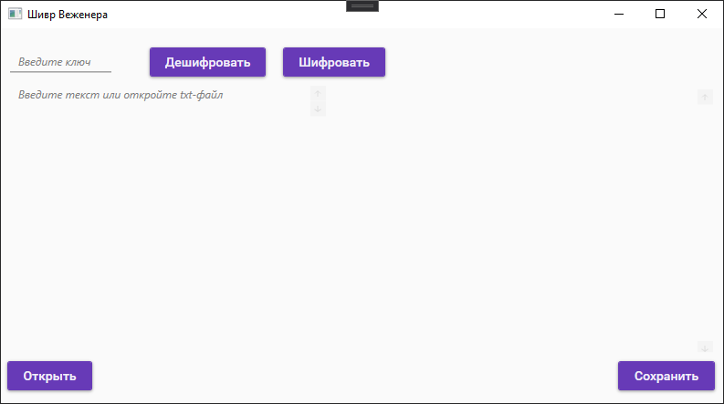
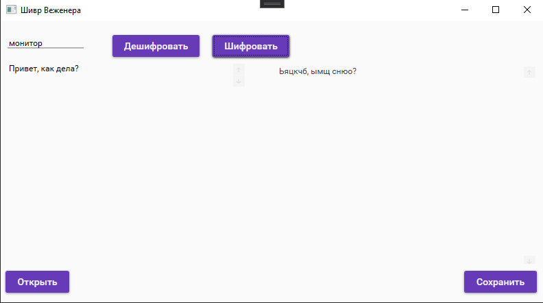
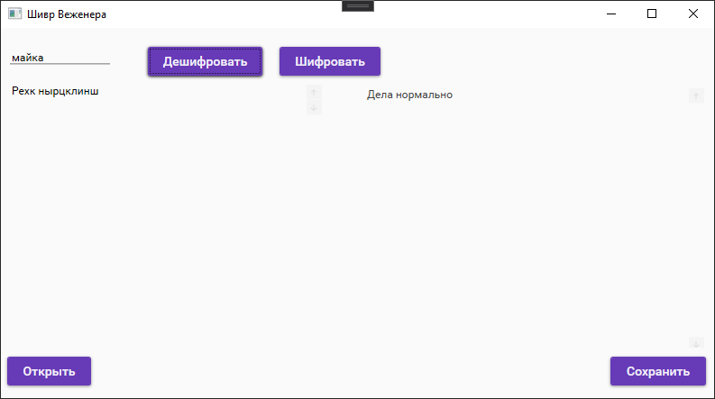

# Cryptographer
[](https://svgshare.com/i/ZhY.svg)
[](https://visualstudio.microsoft.com/)
[](https://dotnet.microsoft.com/)
[](https://github.com/DariyaVisokova/Cryptographer)
[](https://docs.microsoft.com/en-us/dotnet/csharp/programming-guide/)
## Vigenère cipher

WPF C# program is designed to imolement the **Vigenère encryption algorithm**. You can use this program for:

+ Text encryption
+ Text decryption
+ Saving output text
+ Open source document

## Properties

All inteface write in **Russian language** (with custom menu) and use only ru_alphabet.

In WPF programm use:
+ [TextBox](https://docs.microsoft.com/ru-ru/dotnet/desktop/wpf/controls/textbox?view=netframeworkdesktop-4.8)
+ [Button](https://docs.microsoft.com/ru-ru/dotnet/desktop/wpf/controls/button?view=netframeworkdesktop-4.8) 


This program can get and give only **.txt** documents with **UTF8-code**. 


```C#
openfile = new OpenFileDialog
            {
                DefaultExt = ".txt",
                Filter = "(.txt)|*.txt"
            };
            _isFile = openfile.ShowDialog();
            inputText.Text = openfile.FileName;
            if (inputText.Text == "")
            {
                MessageBox.Show("Файл не выбран. Попробуйте еще раз.");
            }
            else
            {
                using (StreamReader reader = new StreamReader(inputText.Text, Encoding.UTF8))
                {
                    textResult = await reader.ReadToEndAsync();
                }
                inputText.Text = textResult;
```


But Tou can write somethink inside left TextBox. The [**Matherial Design**](https://github.com/MaterialDesignInXAML/MaterialDesignInXamlToolkit) add-on was used for design. 



Also this program has **Unit Testing Framework**, where ~~I tryed find some problems and~~ we see, that it don't have some problems :)

``` C#
[TestCase("??????", "!23э", "??????")]
        public void Encoder_Test(string input, string key, string output)
        {
            Assert.AreEqual(EncoderVigener.Encode(input, key), output);
        }
```

## How to use

Put on the button "Открыть" (open) for choose .txt file or write somethink in the left where we can see wotermark for help "Введите текст или откройте txt-файл" ("Input text there or open txt-file").
Thet put inside another field your key for encoder/decoder text where we can see another wotermark "Введите ключ" (Input key). After put on the buttons "Дешифровать"/"Шифровать" (Decoder/Encoder) for action.


*After Encoder ection*

*After Decoder Action*


## Algoritnm

Vigenere Cipher is a method of encrypting alphabetic text. It uses a simple form of polyalphabetic substitution. A polyalphabetic cipher is any cipher based on substitution, using multiple substitution alphabets. The encryption of the original text is done using the [Vigenère square or Vigenère table](https://www.planetaexcel.ru/upload/medialibrary/8b0/vigenere-encription3.png).

In my program I use simple methods for find desired symbol (his position in alphabet) for source text and key. 

``` C#
public static char TakeSymvFromIndex(int index)
        {
            char symv = alphabet[index - 1];
            return symv;
        }
        public static int TakeIndexFromSymv(char symv)
        {
            int numString = alphabet.IndexOf(symv) + 1;
            return numString;
        }
```

And than change position. For example, encoder:
```c#
public static int EncrChangPos(char text, char key)
        {

            int indexPos = (TakeIndexFromSymv(text) + TakeIndexFromSymv(key) - 1) % ruAlphLength;
            if (indexPos == 0)
            {
                indexPos = ruAlphLength;
            }
            return indexPos;
        }
```
And than connect this methods for encoder code:

```c#
public static string Encode(string input, string keyword)
        {
            string result = "";
            int counter = 0;
            int index = 0;


            for (int i = 0; i < input.Length; i++)
            {
                if (alphabet.Contains(input[i]))
                {
                    if (TakeIndexFromSymv(input[i]) <= ruAlphLength)
                    {
                        index = EncrChangPos(input[i], keyword[counter]);
                        result += TakeSymvFromIndex(index);
                    }
                    else
                    {
                        index = EncrChangPos(input[i], keyword[counter]);
                        index += ruAlphLength;
                        result += TakeSymvFromIndex(index);
                    }
                    counter++;
                }
                else
                {
                    result += input[i];
                }
                if (counter == keyword.Length)
                {
                    counter = 0;
                }
            }
            return result;
        }
```

We have little bit different method for decoding, we can wing it inside the program in [EncoderVigeners.cs](/EncoderVigener.cs)
